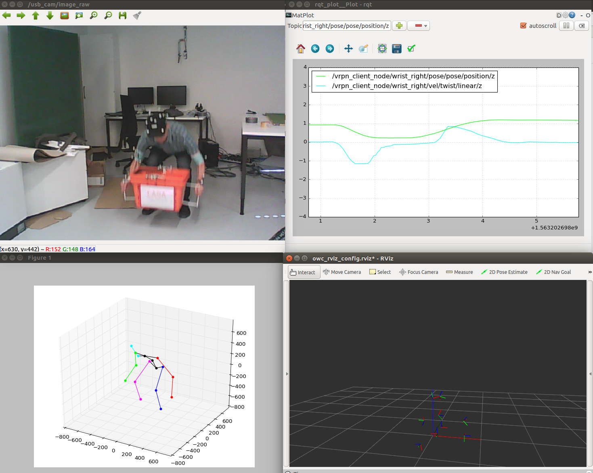

# lift_help_predictor
A collection of tools used to gather, visualize, and analyze human joint data. Later, this data will train an algorithm to identify human need for help during lifting and carrying tasks.

 

The code captures human pose data using two methods: 
 - [OptiTrack Motion Capture](https://optitrack.com/)
 - [Lifting from the Deep: Convolutional 3D Pose Estimation from a Single Image](https://arxiv.org/abs/1701.00295)


### Dependencies 
The code is compatible with [Python2.7](https://www.python.org/download/releases/2.7/) and the following libraries:
 - [Tensorflow 1.0](https://www.tensorflow.org/)
 - [OpenCV](http://opencv.org/)

The following ROS packages are used (and were tested with [ROS indigo]()): 
 - [vrpn_client_ros](http://wiki.ros.org/vrpn_client_ros) 
 - [image_view](http://wiki.ros.org/image_view)
 
For 3D Human Pose Estimation using computer vision, the below repository is included as [Git submodule](https://git-scm.com/book/en/v2/Git-Tools-Submodules): 
   - [Lifting from the Deep](https://github.com/DenisTome/Lifting-from-the-Deep-release) 


### Installation 
From your catkin workspace's ```src/``` directory, clone the repository.  
```
 $ git clone --recursive https://github.com/jaydenleong/lift_help_predictor 
```
Setup the repository and install dependencies. 

```
$ cd lift_help_predictor/
$ source setup.sh
```

### Testing 
TALK about test data included here.

### Additional Material 
TODO: add references to other documentation.md files 

