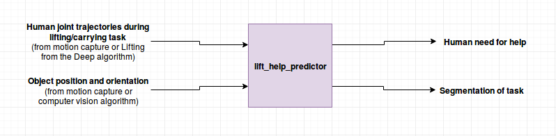

# Algorithm 

### Overview
Humans are able to detect easily whether another human is struggling with lifting an object from their body language. For instance, it is simple for a person to see that another person needs help placing heavy luggage into an overhead bin on a plane. So, with knowledge about others' need of help, humans are able to determine assist others without an explicit request. 

The intention of this algorithm is to develop a similar ability: to detect whether a human needs help or not while lifting/carrying an object from their posture. That way, a robot may be able to intuitively help humans, just as other humans do. 

### The Need for Help   
One way in which humans struggle with lifting/carry objects is due to the weight. Here are some example scenarios: 

* A human struggles when lifting a heavy box
* A human leans to one side when carrying a heavy toolcase 

So, by knowing that weight causes humans to struggle, an algorithm may learn when a human is struggling with a heavy object by the way they move. Elsewhere, there are other factors which may cause a human to struggle, including the following: 

* The shape of the object
* The weight distribution of the object

However, to make the problem tractable, the intention of this project was to focus simply on the weight of the object initially. 

### Features 
Upon recording a few examples of humans lifting a basket containing different weights (as seen in the demo), different features appear to categorize 'human struggling'. For the specific lifting task seen in the demo, here are a few of the features that may be used to identify human need for help: 

* The vertical velocity of the human joints, i.e: how fast they pick up the object 
* The orientation of the object, i.e: whether the human shakes or tilts the object as they lift it 

To identify these features, the visualization tools were built in this repository. They may be used to identify features in arbitrary lifting scenarios. For example, one can plot the vertical acceleration, and angular velocity of the object being lifted. See [visualization.md](./visualization.md) for more about this. 
 
### Implementation Notes  
Here is a simple block diagram of the envisioned inputs and outputs of the algorithm: 

By the motion of the human and the object, the goal is to identify the human need for help. As well, the algorithm may include task segmentation to determine what the human is doing, i.e: lifting, carrying. That way, the robot will understand how to interact with the human at a given time, as well as knowing whether the human needs help. 

